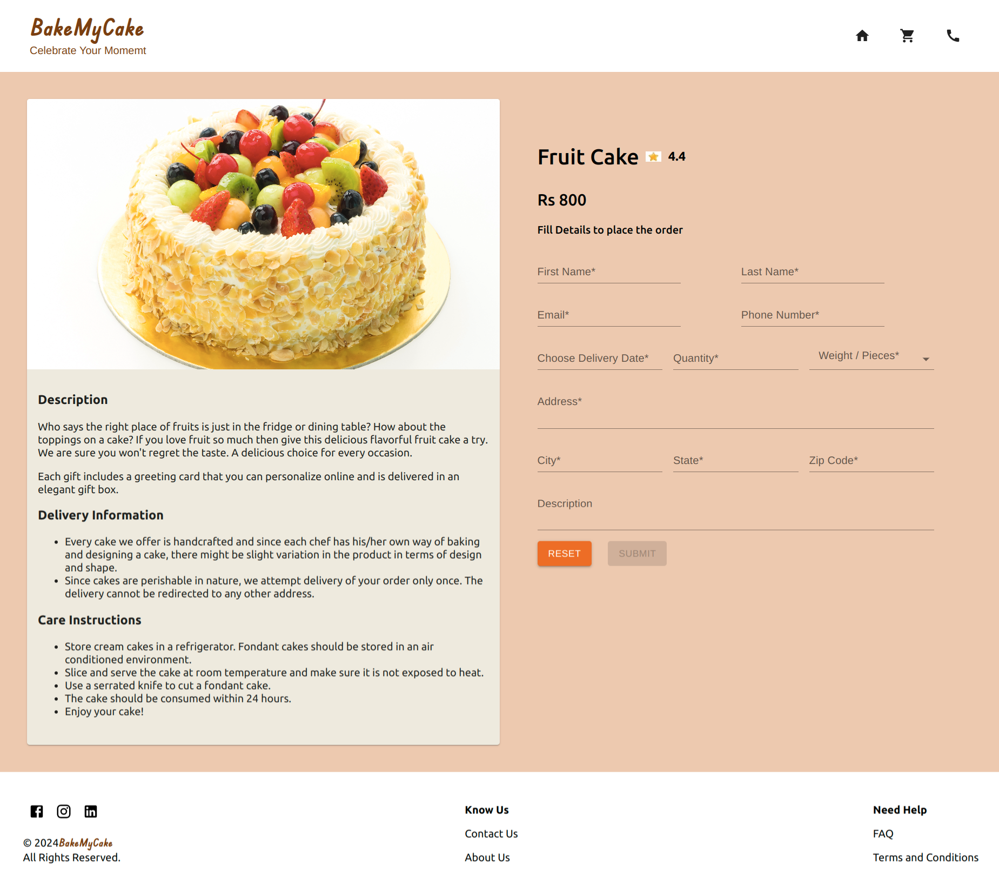
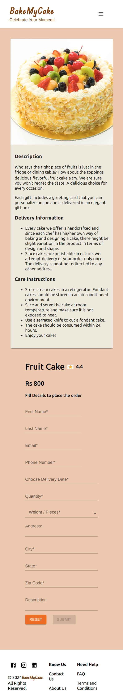
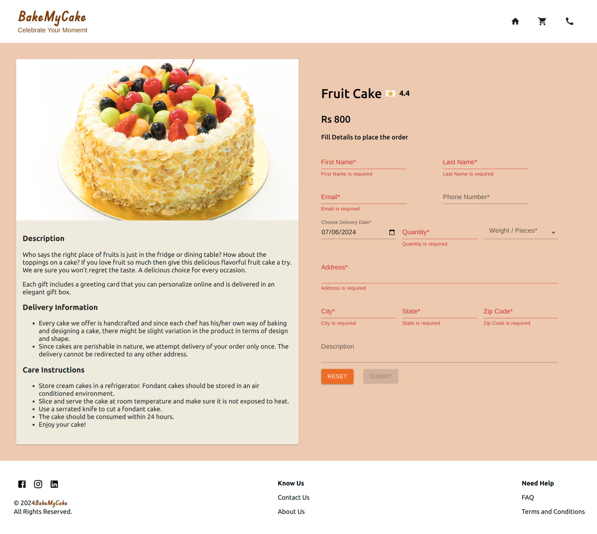
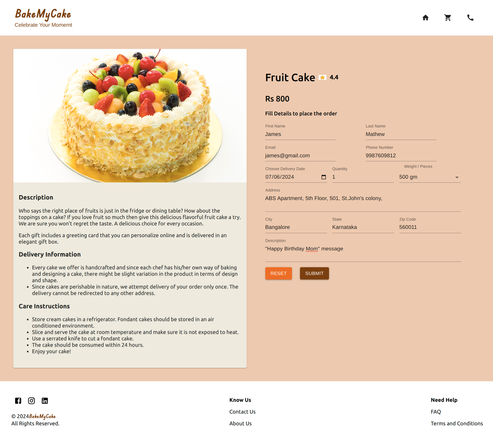

In the first phase, the application allowed the customers to view a list of cakes, cookies, or brownies available in the cake shop.​ The delicacies are displayed with attractive images and crisp details like name and price. ​

The app also allowed to search and filter the items by the user’s preference for a quick selection. ​Unit test cases for each component are created to make the app robust.
  - The data must be fetched using json-server.​
  - Filtering allows user to filter items by category.​
- The user will be navigated to the order view once he selects a particular item on the home view.​
- The order view should display the details of the item selected.​
- This view should also allow users to provide the details required for placing the order for the selected item.​
- The details should include the item name as well as the customer details.
  - Design the order form using Material components. Use React Hook Form to validate the form fields and to handle form submission.  ​
- The details should be persisted, and the customer should be acknowledged after the order is successfully placed.(Hint: Use Material snackbar)​
- After successful order placement, the customer should be navigated to the home view.​
​

**Bake My Cake - Order View - Desktop**

**Bake My Cake - Order View - Mobile**

**Bake My Cake - Order Form with Invalid Data**

**Bake My Cake - Order Form with Invalid Data**

**Bake My Cake - Order Form with Valid Data**

